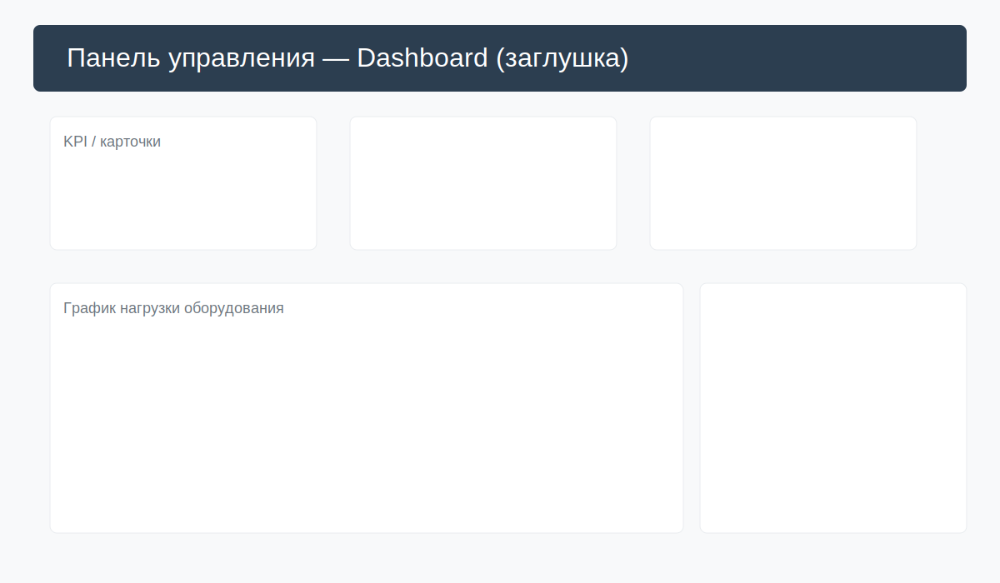
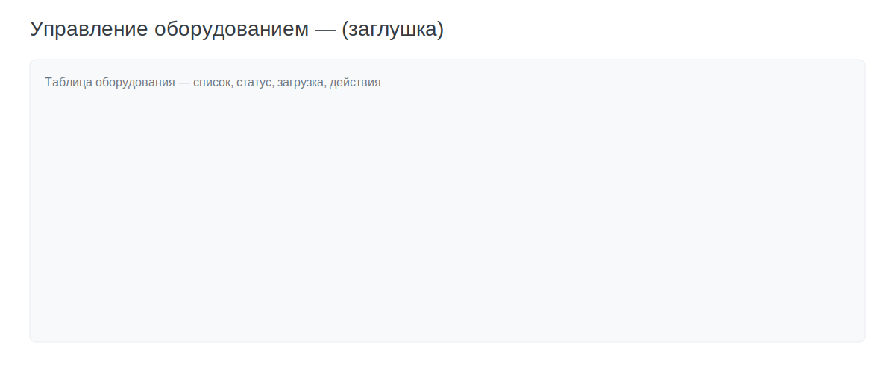

# MES — Manufacturing Execution System (Лабораторная работа 6)

Полнофункциональная демонстрационная система управления производством (MES) — фронтенд на React + Vite, бэкенд на FastAPI, PostgreSQL и Redis. Проект демонстрирует мониторинг оборудования в реальном времени, управление заказами, сбор KPI и простую аналитику для выявления узких мест.



---

**Коротко:** система поддерживает роли пользователей (dispatcher/planner/admin), CRUD для оборудования, заказов и операций, события оборудования, хранение KPI и аналитические эндпойнты.

## Быстрый старт

1. Откройте проект:

```bash
cd /home/marat/Desktop/laba6
```

2. Убедитесь, что установлены: `docker` и `docker compose`.

3. Запустите всё в контейнерах (сборка при первом запуске):

```bash
docker compose up --build
```

4. Откройте:

- Frontend: http://localhost:3000
- Swagger (API docs): http://localhost:8000/docs

> По умолчанию seed-скрипт создаёт администратора:
>
> ```
> Email: admin@example.com
> Password: admin123
> ```

## Структура репозитория

```
/home/marat/Desktop/laba6
├─ backend/                 # FastAPI приложение
│  ├─ app/
│  ├─ Dockerfile
│  └─ requirements.txt
├─ frontend/                # React + Vite приложение
│  ├─ src/
│  ├─ Dockerfile
│  └─ package.json
├─ docker-compose.yml
└─ lab6/                   # (frontend+backend copy used in lab6 folder)
   └─ docs/screenshots/    # SVG-заглушки скриншотов
```

## Возможности

- Регистрация и аутентификация (JWT)
- Управление оборудованием (CRUD)
- Управление производственными заказами с приоритетами
- Операции, связываемые с заказами и оборудованием
- Сбор событий оборудования (simple event logs)
- KPI (OEE, availability, performance, quality)
- Аналитика: дашборд, статус оборудования, детекция узких мест
- Простая роль-ориентированная модель пользователей

## Схема API (кратко)

- `POST /api/register` — регистрация
- `POST /api/token` — получение JWT (OAuth2 password)
- `GET /api/me` — профиль пользователя
- `GET/POST/PUT /api/equipment` — оборудование
- `GET/POST/PUT /api/orders` — заказы
- `GET/POST/PUT /api/operations` — операции
- `GET/POST /api/equipment-events` — события оборудования
- `GET/POST /api/kpis` — KPI
- `GET /api/analytics/*` — аналитика (dashboard, equipment-status, bottlenecks)

Полная документация: http://localhost:8000/docs

## Frontend — обзор

Главные компоненты:

- `Dashboard` — KPI карточки, графики нагрузки, таблица статусов
- `EquipmentManager` — CRUD и мониторинг оборудования
- `OrdersManager` — создание/фильтрация заказов
- `Login` / `Register` — аутентификация



## Скриншоты (заглушки)

- Dashboard: `lab6/docs/screenshots/dashboard.svg`
- Equipment manager: `lab6/docs/screenshots/equipment.svg`
- Orders manager: `lab6/docs/screenshots/orders.svg`

Замените эти SVG-файлы реальными PNG/JPG скриншотами в папке `lab6/docs/screenshots/`.

## Запуск локально (без Docker)

> Рекомендуется Docker, но если хотите запускать вручную — в `backend` можно создать виртуальное окружение и установить зависимости.

```bash
# backend
cd backend
python3 -m venv .venv
source .venv/bin/activate
pip install -r requirements.txt
uvicorn app.main:app --reload --host 0.0.0.0 --port 8000

# frontend
cd ../frontend
npm install
npm run dev
```

## Отладка и логи

Просмотр логов контейнера backend:

```bash
docker compose logs -f backend
```

Доступ к базе:

```bash
docker compose exec db psql -U postgres -d postgres
```

## Переменные окружения (`.env.backend`)

```ini
DATABASE_URL=postgresql://postgres:postgres@db:5432/postgres
REDIS_URL=redis://redis:6379/0
SECRET_KEY=supersecret_lab6_key
ACCESS_TOKEN_EXPIRE_MINUTES=60
INITIAL_ADMIN_EMAIL=admin@example.com
INITIAL_ADMIN_PASSWORD=admin123
```

## Технические заметки

- В `security.py` применён фикс для bcrypt (72-byte limit) перед хешированием пароля.
- CORS включён в `main.py` для разработки (allow_origins="*").
- Seed-скрипт `backend/app/seed.py` создаёт администратора при первом запуске.

## Roadmap / Что можно добавить

- WebSocket/Server-Sent Events для настоящего realtime
- RBAC / расширенные роли и права
- Export PDF/Excel отчетов
- Интеграция с PLC/SCADA через MQTT/OPC UA
- ML-прогноз отказов и оптимизация расписания

---

Если хотите, я могу:

- Встроить ваши реальные скриншоты в `docs/screenshots`
- Подготовить production Docker image
- Подключить WebSocket для live-обновлений

Скажите, что сделать следующим шагом.